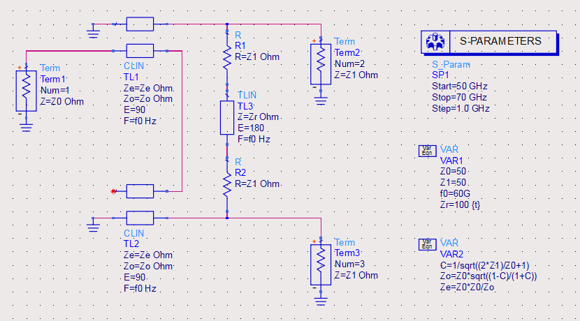
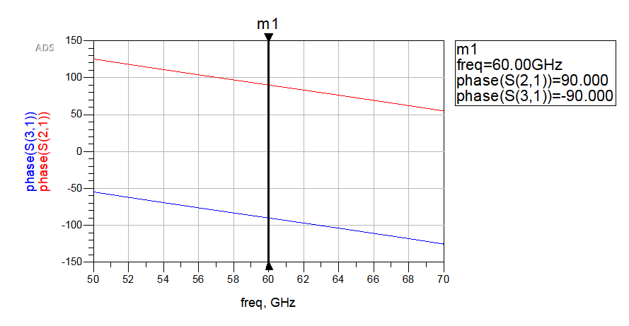
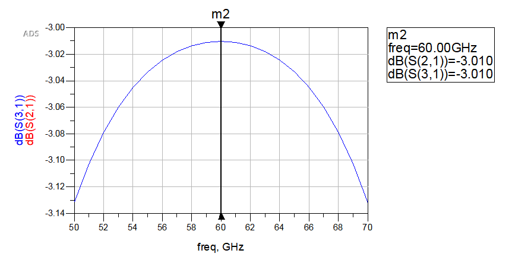
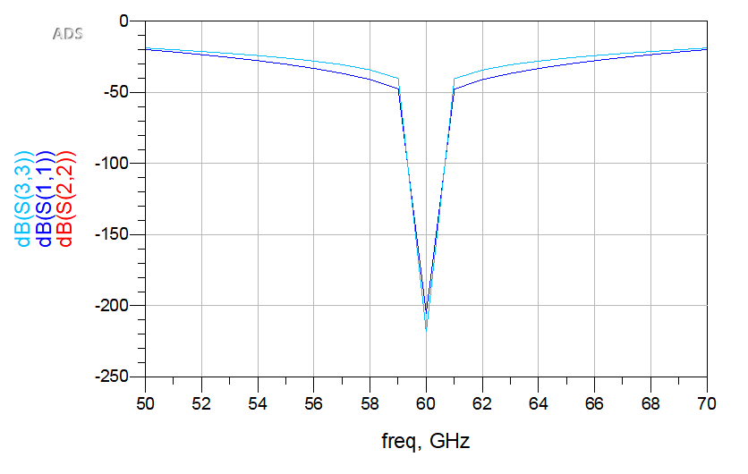

# marchand_balun
A marchand balun design in ADS

I am just trying to replicate resistive network Marchand Balun as discussed in [Analysis and Design of Impedance-Transforming Planar Marchand Baluns](http://sci-hub.tw/https://ieeexplore.ieee.org/document/903108) and [60GHz Balun Design chinese article](https://sites.google.com/site/emfile01/mmic-lun-wen_2012qiu/60GHz%20Marchand%20Balum%E5%9F%BA%E6%9C%AC%E8%A8%AD%E8%A8%88_watermark.pdf) in Keysight ADS software.

Note: For ADS user, simply replace your cell with [resistive_network_marchand_balun](./resistive_network_marchand_balun) and its [resistive_network_marchand_balun.dds file](./resistive_network_marchand_balun.dds)

**balun schematics**

**balun phase**

**balun insertion loss**

**balun return loss**

TODO:

- Migrate the design to [openEMS](https://github.com/thliebig/openEMS-Project) so that it could be reused in computer system without ADS software
- Layout of the improved marchand balun as discussed in [MMIC Planar Spiral Balun Design using Keysight ADS](https://youtu.be/rPTjrR7D9j0)
- Math derivation of the coupling factor, C
